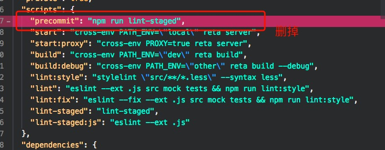

# aboutTerminal

1. *pre-commit hook failed (add --no-verify to bypass)* 导致代码无法提交   
答：这是代表你提交的东西不符合commit规则，你可以看哪些不符合规则，逐个改正；也可以在相关文件中，删掉关于提交规则的设定。  
pakage.json文件中更改：  

 

2. 使用npm安装依赖时，终端报错出现 *Maximum call stack size exceededill install loadIdealTree*  
答：This is an error with npm itself，使用`cnpm`或`yarn`试试
